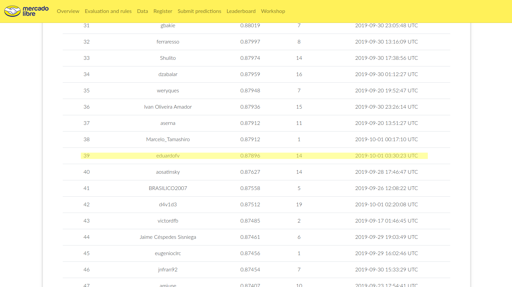

# MercadoLibre Data Challenge 2019

[https://ml-challenge.mercadolibre.com/](MeLi 2019)

Best Model:

- Two part neural network: nnlm embeddings + multi layer perceptron
- Phrase embeddings with Tensorflow hub:
	- Neural Network Language Model NNLM embeddings, spanish, 128 dimensions with normalization [https://tfhub.dev/google/tf2-preview/nnlm-es-dim128-with-normalization/1](tfhub)
- 2 hidden layer MLP [2048, 2048], one intermediate input for the language class ("sp" or "po")
	- The embeddings layer is trained along with the MLP
- Trained with the full 20M dataset in:
	- About 1 hour on a p3.2xlarge instance in AWS
	- About 2 hours on a p2.xlarge instance in AWS
	- About 24 hours on a GTX960M GPU
	- *Would train for some 52 hours on a Macbook pro 2015 CPU*
- Keras with Tensorflow 2.0

**Really cool finding: the spanish language model can be trained with portuguese features and reach a similar BAC**

### Model Summary

```
Model: "model"
__________________________________________________________________________________________________
Layer (type)                    Output Shape         Param #     Connected to                     
==================================================================================================
keras_layer_input (InputLayer)  [(None,)]            0                                            
__________________________________________________________________________________________________
keras_layer (KerasLayer)        (None, 128)          125009920   keras_layer_input[0][0]          
__________________________________________________________________________________________________
DEN_1 (Dense)                   (None, 2048)         264192      keras_layer[0][0]                
__________________________________________________________________________________________________
dropout (Dropout)               (None, 2048)         0           DEN_1[0][0]                      
__________________________________________________________________________________________________
DEN_2 (Dense)                   (None, 2048)         4196352     dropout[0][0]                    
__________________________________________________________________________________________________
dropout_1 (Dropout)             (None, 2048)         0           DEN_2[0][0]                      
__________________________________________________________________________________________________
input_1 (InputLayer)            [(None, 1)]          0                                            
__________________________________________________________________________________________________
concatenate (Concatenate)       (None, 2049)         0           dropout_1[0][0]                  
                                                                 input_1[0][0]                    
__________________________________________________________________________________________________
DEN_OUT (Dense)                 (None, 1576)         3230800     concatenate[0][0]                
==================================================================================================
Total params: 132,701,264
Trainable params: 132,701,264
Non-trainable params: 0
__________________________________________________________________________________________________

```

Check final model in [plain python](./analysis/meli-TFH-v3.py) or jupyter notebook. For the final submission the model was trained twice, once in spanish and once in portuguese and predictions were merge accordingly.

Hope to put other models tested and jupyter notebooks soon.

I'm pretty happy with the final score 0.8789 which is far from first places but uses a quite simple model.



